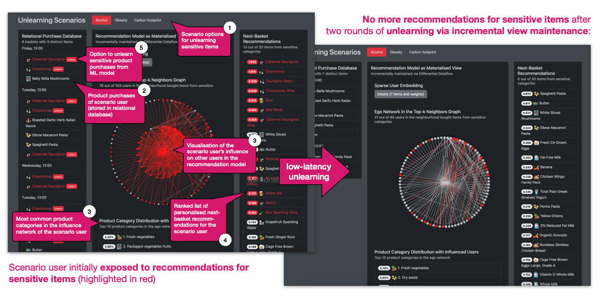

# Snapcase

This repository contains the source code for our demo submission _"Snapcase - Regain Control over Your Predictions with Low-Latency Machine Unlearning"_ to VLDB'24.

## Running the demonstration yourself

  1. Make sure you have a recent version of [Rust](https://www.rust-lang.org/tools/install) installed. We recommend version 1.72.0, newer versions might cause problems with differential dataflow.
  2. Clone this repository locally via `git clone https://github.com/amsterdata/snapcase-demo` and change into the `snapcase-demo` folder
  3. Download the prebuilt top-k index and the purchase database from [Google Drive](https://drive.google.com/drive/folders/1JCpR5RIfgmtUaxTMzkdVjfSODx41t3FF?usp=sharing). The `__instacart-index.bin` file 
must be placed directly in the `snapcase-demo` folder, and the `*.parquet` files must be placed in the `datasets/instacart/` subfolder.
  4. Start the demo with the following command: `cargo run --release --bin service` (you may need to specify the rust version, e.g., `cargo +1.72.0 run --release --bin service` )
  5. You should see some console output from DuckDB and Differential Dataflow, after which the demo will be served at http://localhost:8080 , which you can open in a browser

## Inspecting the source code

We provide a few pointers for researchers interested in understanding the source code:

 * Our implementation of the [TIFU model for next-basket recommendation](https://arxiv.org/abs/2006.00556) in Differential Dataflow is available in the [src/tifuknn](src/tifuknn) folder.
 * Our data structure and algorithm for [efficiently maintaining a top-k aggregation over the result of a sparse matrix multiplication](https://dl.acm.org/doi/abs/10.1145/3539618.3591989) is available in the [src/caboose](src/caboose) folder.
 * The code to coordinate the incremental view maintenance of the recommendation model is available in the [src/materialised](src/materialised) subfolder.

## Attribution

This demonstration uses icons from the [Flaticon platform](https://www.flaticon.com/).

